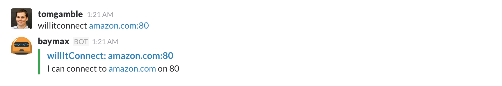

# hubot-will-it-connect

[](https://app.wercker.com/project/bykey/f9778be63b53ef447f578b62972b3c0a)

Connects hubot with willitconnect, to validate CF's ability to connect to external resources

See [`src/will-it-connect.coffee`](src/will-it-connect.coffee) for full documentation.

## Installation

In hubot project repo, run:

`npm install hubot-will-it-connect --save`

Then add **hubot-will-it-connect** to your `external-scripts.json`:

```json
[
  "hubot-will-it-connect"
]
```

## Sample Interaction



## More Information

[Learn more about willitconnect](https://github.com/krujos/willitconnect)
